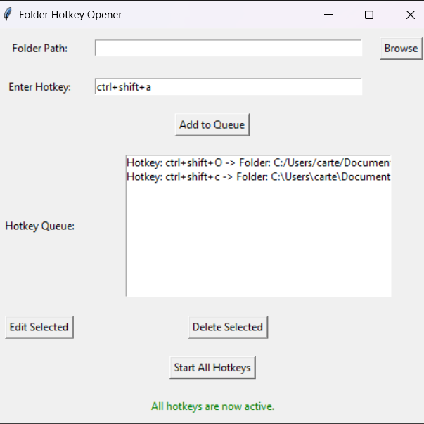

# Macro

Macro is a small desktop utility for opening folders with global keyboard shortcuts. Add one or more folder and hotkey pairs, start the hotkeys, and keep the app running from the system tray.



## Features

- Create global hotkeys for frequently used folders.
- Manage multiple folder shortcuts from a Tkinter window.
- Edit or remove saved hotkey-folder pairs.
- Persist shortcuts in `hotkey_queue.json`.
- Run quietly from the system tray.
- Supports Windows, macOS, and Linux folder opening commands.

## Requirements

- Python 3.10+
- Packages listed in `requirements.txt`

Global hotkey support may require elevated permissions depending on your operating system and security settings.

## Setup

Install dependencies:

```powershell
python -m pip install -r requirements.txt
```

Run the app:

```powershell
python Macro.py
```

## Usage

1. Launch the app.
2. Open the tray menu and choose **Show**.
3. Browse for a folder.
4. Enter a hotkey such as `ctrl+shift+a`.
5. Click **Add to Queue**.
6. Click **Start All Hotkeys**.

The app stores shortcuts locally in `hotkey_queue.json`, which is ignored by Git so personal folder paths are not committed.

## Portfolio

Portfolio page: [Hotkey Folder Macro](https://wchowellarchive.web.app/Projects/Hotkey/Hotkey.html)

## Status

This is an early utility project. Good next improvements would be packaging it as a Windows executable, adding import/export for shortcut profiles, improving validation for more key combinations, and adding tests around queue persistence.
